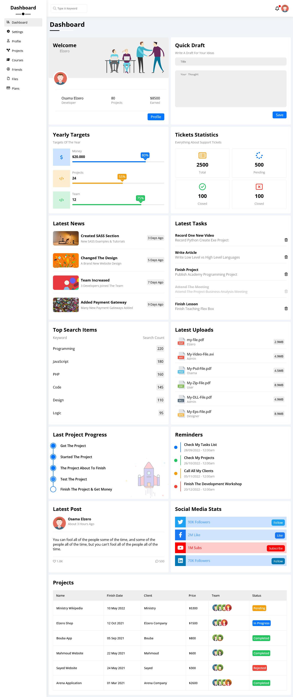

<div align="center">
  <h2 align="center">Dashboard</h2>
  <a href="https://youssef9005.github.io/Dashboard/"><strong>➥ Live Demo</strong></a>
</div>

<h2>Website Preview</h2>



## Clone Website

Linux and macOS:

```bash
sudo git clone https://github.com/Youssef9005/Dashboard.git
```

Windows:

```bash
git clone https://github.com/Youssef9005/Dashboard.git
```

<div align="center">
    <h2>Contact Me</h2>
    <span>Contact Me By </span><a href="https://instagram.com/youssef_65_sameh?utm_source=qr"><strong>Instgram</strong></a>
</div>
